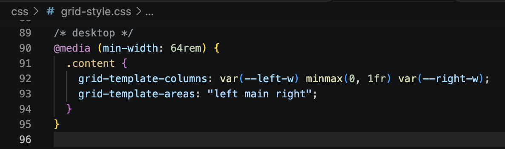
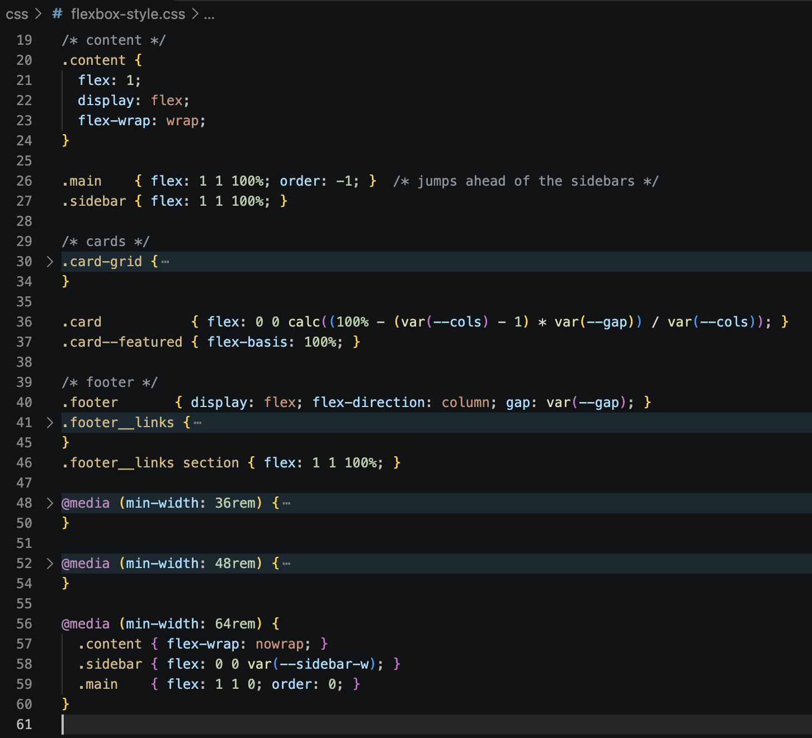
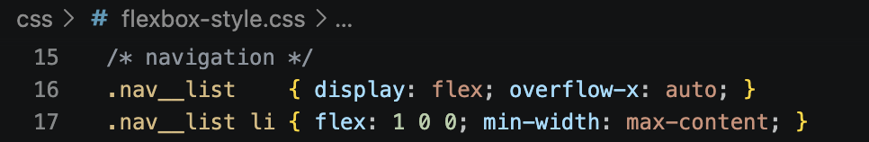
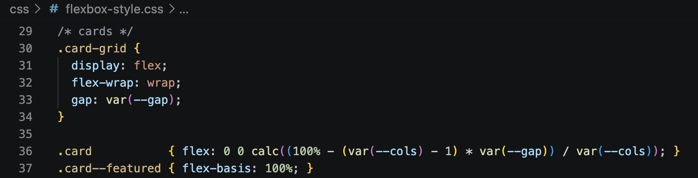
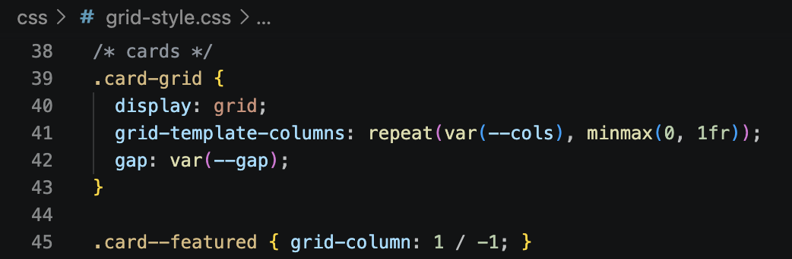
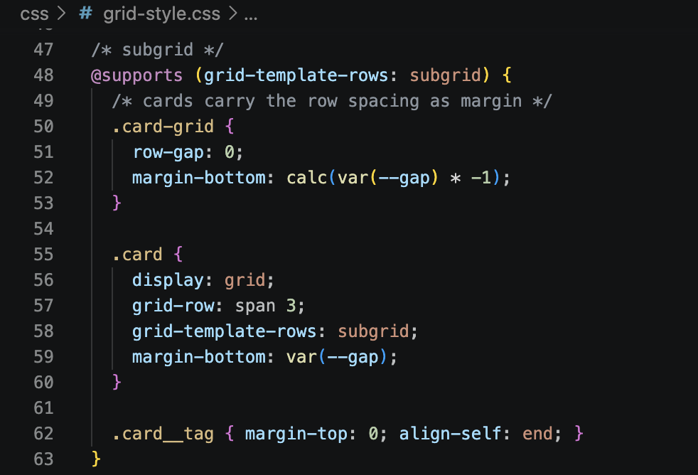

# Level 4 Reflection: Flexbox vs. Grid

I built the same Holy Grail page twice, once with Flexbox and once with Grid. Both use the same HTML and share one `base.css`, so the only thing that changes is the layout file.

## Which was easier to implement?

For the main page layout, Grid was easier. I could just write down where I wanted things to go. On desktop it is one line: left, main, right.

Flexbox took more thinking. The sidebars sit below the content on a phone, but I wanted the main content to come first. So I had to use `order: -1` and then undo it on big screens.

Flexbox was easier for the small stuff, like the nav bar, where a few lines did the job.

## Which required less code?

Flexbox. Its file is 60 lines and the Grid file is 95. Most of the difference comes from the cards. In Flexbox I had to work out each card's width with a `calc()`:

Grid reads better here, because `repeat()` just says "this many columns":

But I wanted the card titles, text and tags to line up across a row, and that needed the extra subgrid block below. That block is a big part of why the Grid file is longer.

## Which was more intuitive?

Grid, for the page as a whole, because the code looks like the page. I can read the area names and picture the layout. Flexbox felt more natural for things that sit in one line, like the header and the nav. By the way, there's one thing that tripped me up in Grid: at 375px the page scrolled sideways until I switched the column to `minmax(0, 1fr)`

## In what scenarios would I prefer one over the other?

I'd use Grid for the big structure of a page, especially when there are named sections or things that need to line up in rows and columns. I'd use Flexbox for the pieces inside those sections, like menus, button rows and the contents of a card. In a real project I'd use both together: Grid for the frame, Flexbox inside it
